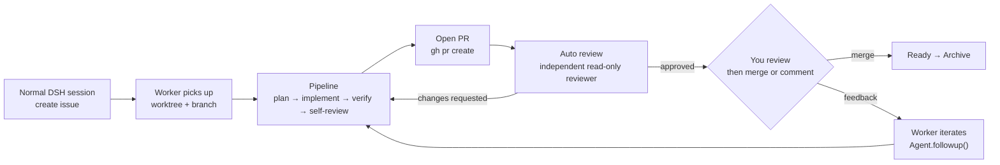

# dsh-orchestrator

A PRD for **DSH Orchestrator** — a [DeepSeek Harness](https://github.com/deepseek-ai/deepseek-harness) plugin that turns a normal DSH session into a project control room: create issues, let workers pick them up, run them through a pipeline to a pull request, then merge or leave review feedback and have the same worker iterate.

It is a DSH-native reinterpretation of [Untrivial-ai/agent-orchestrator](https://github.com/Untrivial-ai/agent-orchestrator), scoped to DeepSeek Harness only: no cloud service, no extra daemon, no other agent harness.

## Documents

| Document | What it is |
|---|---|
| **[PRD.md](PRD.md)** | The product requirements: goals, flow, architecture, domain model, pipeline, GitHub integration, Kanban, UI, tools, config, NFRs, risks, milestones, acceptance criteria |
| **[docs/dsh-plugin-contract.md](docs/dsh-plugin-contract.md)** | Appendix A — every DSH plugin API the design depends on, verified against the installed `0.1.7-rc.2` artifacts, with evidence |
| **[docs/agent-orchestrator-reference.md](docs/agent-orchestrator-reference.md)** | Appendix B — the reference product teardown, with citations |
| **[docs/open-questions.md](docs/open-questions.md)** | Decisions needed before implementation starts, with recommendations |

**Start here:** [PRD.md §0 TL;DR](PRD.md#0-tldr) → [§4 the primary flow](PRD.md#4-users-and-the-primary-flow) → [docs/open-questions.md](docs/open-questions.md).

## The short version

DSH already ships two of the hardest primitives, and neither is enabled by default:

1. `@deepseek-ai/dsh-webhook` + `@deepseek-ai/dsh-webhook-github` — signed GitHub ingress that creates agent sessions, with a documented opt-in overlay.
2. An **unoccupied** full-page panel seat (`main`, keyed, root-scoped) plus `sidebar.panellist` for the navigation row that selects it.

So this is not "port a Go daemon". It is: spawn one resumable DSH root session per issue in its own git worktree, drive it through a staged pipeline with a small worker-protocol toolset, observe the resulting PR with `gh`, and render a **derived** Kanban into that panel — one panel and one sidebar row per connected project, so each board is scoped to its own project rather than aggregating every one. The board is never dragged — placement comes from durable facts through a reducer ported from the reference's `backend/pkg/contract/kanban.go`.

**The review order is the point:** the plugin's own read-only reviewer passes over every PR head first and the worker iterates on its findings until that pass approves — *then* the card moves to `In review` and waits for you. A PR never reaches a human unreviewed, and never reaches `Ready` without a human approval.

## Status

Built and in use. The plugin ships the derived board read model, the worker spawner and its staged pipeline (plan → implement → verify → self-review), the `gh` pull-request observer, the auto-review loop that keeps a pull request out of `In review` until the plugin's own read-only reviewer approves its head, and the feedback loop that queues review comments back into the same worker session. `npm run verify` — typecheck, the full test suite, and the build — is green, and the board/worker/reviewer loop runs against this repository itself.

What is not built: there is no merge button (merging stays a human action in GitHub), no pull-request discovery beyond the observer's recovery pass for one it has lost track of, and no M6 hardening — webhook ingress, the plan gate, the notification badge, the `token+fetch` fallback, dedicated agent presets, and the reviewer panel — which [PRD.md §16](PRD.md#16-milestones) marks optional.

The design is grounded in a **local clone of AO's `main`** (`53ba1e8`), not just its documentation. Where prose and code disagreed, the code won — see [Appendix B §B15](docs/agent-orchestrator-reference.md) for the code-level findings and the list of verified constants.

### Four findings that changed the design

**Their local daemon has no webhook code at all.** `grep -ril webhook backend/` matches three `doc.go` files, each listing webhook ingestion as *out of scope*; no HMAC or `X-Hub-Signature-256` appears anywhere in `backend/`. Webhooks live only in their cloud — and even there a 30-second poller exists to recover when *"GitHub webhooks fail or remain silent."* So this design polls, with a webhook as an optional accelerator rather than the source of truth.

**The reviewer must execute nothing.** Not "run read-only checks" — AO's reviewer prompt forbids running *any* project program, test, build, or formatter, because the reviewer shares the worker's worktree and a test run writes caches and snapshots into the diff under review. A `read-only` permission preset is necessary but not sufficient.

**Activity has three predicates, not one.** `waiting_input` and `blocked` both render as "waiting on you" but demand *opposite* automation, and both are **sticky** — a paused agent stays paused until a new signal, never until a clock. Collapsing these is the easiest way to silently drop a worker's question off the board.

**DSH gets a whole hazard class for free.** AO wraps every nudge in a `sessionguard` with eight refusal reasons, because its nudges are a terminal **paste + Enter** — a stray write can answer a user's permission dialog on their behalf. `Agent.followup()` enqueues into an **inbox** instead, so there is no dialog in the write path at all. Three of AO's guards have no DSH analogue, and queuing feedback for a blocked worker is simply *safe* rather than a hazard to be gated.
